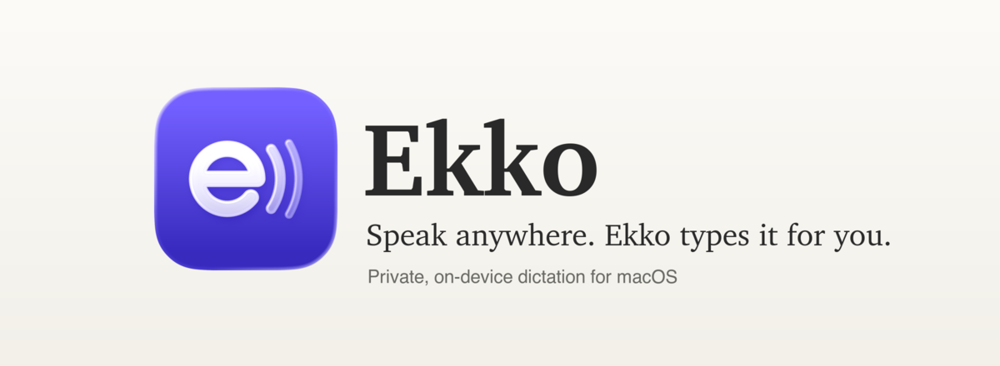
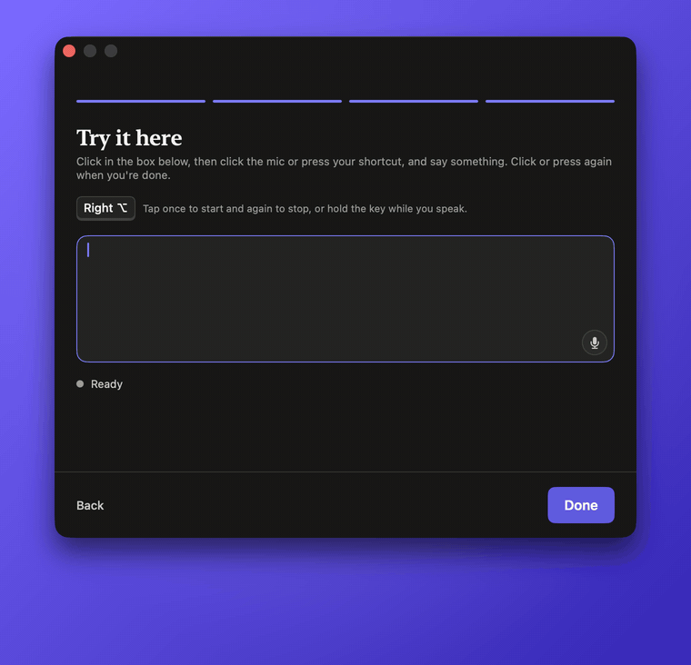
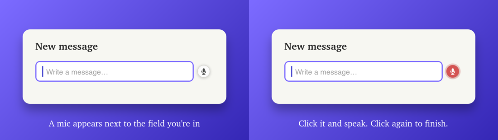
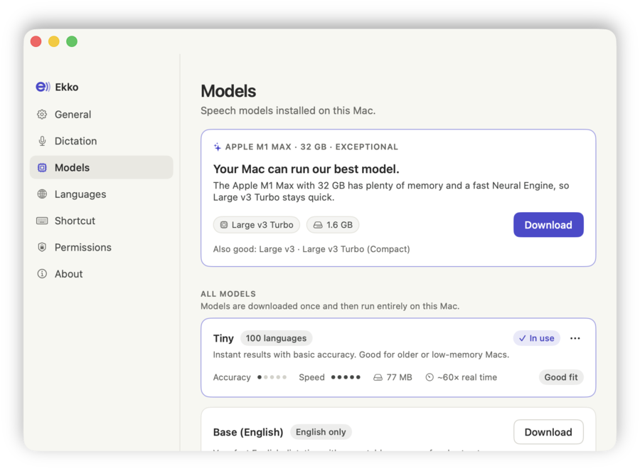
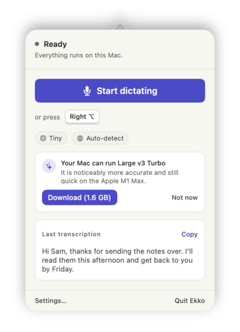
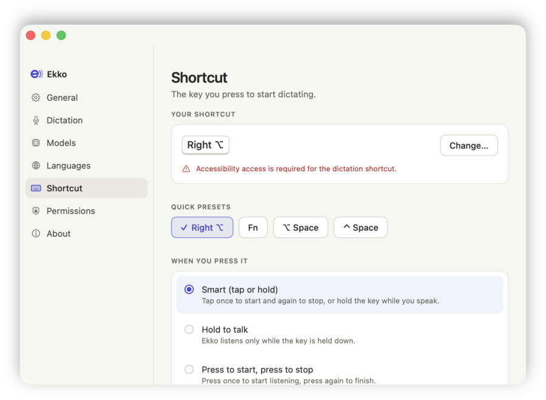
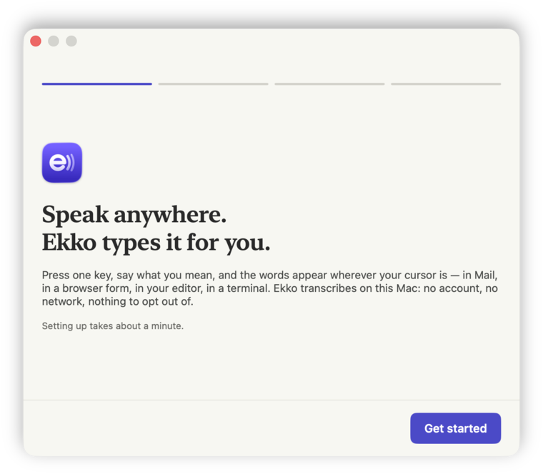
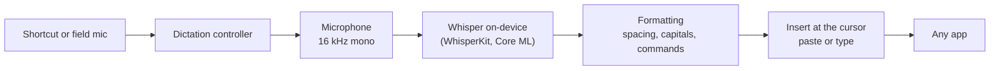

<p align="center">
  <picture>
    <source media="(prefers-color-scheme: dark)" srcset=".github/assets/banner-dark.png">
    
  </picture>
</p>

<p align="center">
  
  
  
  
  
  
</p>

**Ekko turns your voice into text in any app on your Mac.** Click into a note, an email, a browser form, a chat box or your code editor, press one key (or click the little mic that appears beside the field), say what you mean, and the words appear at your cursor.

Everything runs on your Mac. Speech is transcribed locally with OpenAI's Whisper models through [WhisperKit](https://github.com/argmaxinc/WhisperKit). There is no account, no cloud service and no analytics, and your audio never leaves your computer.

Ekko was built for people who find typing hard, slow or painful, and it's pleasant for everyone else too.

<p align="center">
  
</p>

## Highlights

- **Works everywhere you can type.** Ekko pastes at the cursor in any app and puts your clipboard back afterwards. A "type keystrokes" mode covers the few apps that block pasting.
- **Click or keyboard, your choice.** A small mic appears beside whichever text field you're in; click it to start and click again to finish. Or tap <kbd>Right ⌥</kbd> to start and stop, or hold it while you speak.
- **Private by design.** Transcription happens on-device. The only network traffic is the one-time download of the speech model you choose.
- **Picks the right model for your Mac.** Ekko reads your chip and memory, recommends the best model your Mac can run comfortably, and suggests an upgrade when a better one fits.
- **100 languages.** Leave language on Auto-detect or choose one. Dedicated English models are faster and smaller when that's all you need.
- **Calm, clear feedback.** A floating status pill shows when Ekko is listening, working or done, and the menu-bar icon pulses with your voice.
- **Tidy text.** Smart capitalisation and spacing that respect what's already in the field, plus optional spoken punctuation ("new line", "comma", "question mark").

## A closer look

### A mic next to every text field

<p align="center">
  
</p>

Click into any text field and Ekko's mic appears beside it. It never takes focus away from the field, so the transcript lands exactly where your cursor is. It fades back while you type and can be switched off in Settings.

### Always know what's happening

<table>
  <tr>
    <td width="50%" align="center">
      <br>
      <sub>The status pill: listening, transcribing, inserted.</sub>
    </td>
    <td width="50%" align="center">
      <br>
      <sub>The menu-bar icon pulses with your voice.</sub>
    </td>
  </tr>
</table>

### Screenshots

<table>
  <tr>
    <td width="62%">
      <picture>
        <source media="(prefers-color-scheme: dark)" srcset=".github/assets/settings-models-dark.png">
        
      </picture>
    </td>
    <td width="38%">
      <picture>
        <source media="(prefers-color-scheme: dark)" srcset=".github/assets/popover-dark.png">
        
      </picture>
    </td>
  </tr>
  <tr>
    <td width="62%">
      <picture>
        <source media="(prefers-color-scheme: dark)" srcset=".github/assets/settings-shortcut-dark.png">
        
      </picture>
    </td>
    <td width="38%">
      <picture>
        <source media="(prefers-color-scheme: dark)" srcset=".github/assets/onboarding-dark.png">
        
      </picture>
    </td>
  </tr>
</table>

## Getting started

### Requirements

- macOS 14 Sonoma or later. Apple Silicon is recommended; Intel Macs work with the smaller models.
- Between 77 MB and 1.6 GB of disk space for a speech model.
- Microphone and Accessibility permissions. Ekko asks for both during setup.

### Build and run

Ekko is built from source with Xcode 26 and [XcodeGen](https://github.com/yonaskolb/XcodeGen).

```bash
brew install xcodegen
git clone https://github.com/REllwood/Ekko.git
cd Ekko
xcodegen generate
open Ekko.xcodeproj
```

Choose the **Ekko** scheme and press Run. To sign with your own Apple ID, change `DEVELOPMENT_TEAM` in [`project.yml`](project.yml) to your team ID and run `xcodegen generate` again.

To build a release copy from the command line:

```bash
xcodebuild -project Ekko.xcodeproj -scheme Ekko -configuration Release -derivedDataPath build/DerivedData build
open build/DerivedData/Build/Products/Release/Ekko.app
```

### First run

A short setup walks you through four steps:

1. **Welcome.**
2. **Permissions.** Microphone, so Ekko can hear you, and Accessibility, so it can notice your shortcut and type into other apps.
3. **Choose a model.** The recommendation for your Mac is preselected. It downloads once and then works offline.
4. **Try it.** Dictate into a practice box to see it work. This step works even before Accessibility is granted.

> [!NOTE]
> The first time a model loads, macOS optimises it for your Mac's Neural Engine. For the large models this can take a few minutes. Ekko shows its progress, and every launch after that is instant.

## Using Ekko

| To… | Do this |
| --- | --- |
| Start dictating | Tap <kbd>Right ⌥</kbd>, click the mic beside the text field, or choose **Start dictating** in the menu bar. |
| Finish | Tap <kbd>Right ⌥</kbd> again, or click the mic again. |
| Push to talk | Hold <kbd>Right ⌥</kbd> while you speak and let go when you're done. |
| Cancel | Press <kbd>Esc</kbd> while Ekko is listening. |
| Copy the last dictation | Open the menu-bar popover and click **Copy**. |

**Shortcut.** Right Option works in "Smart" mode by default: tap to start and tap to stop, or hold to talk. Settings › Shortcut offers presets (<kbd>Right ⌥</kbd>, <kbd>Fn</kbd>, <kbd>⌥ Space</kbd>, <kbd>⌃ Space</kbd>), lets you record your own, and switches between Smart, Hold to talk, and Press to start / press to stop. Typing with the shortcut key, for example <kbd>⌥ 3</kbd> for "#" on a UK keyboard, is recognised as typing and won't leave Ekko listening.

**How text arrives.** *Automatic* pastes and then restores your clipboard, and types the text instead if the paste can't be sent. You can also choose *Paste*, *Accessibility* (insert directly without the clipboard) or *Type keystrokes* (for apps that block pasting) in Settings › Dictation.

**Voice commands** (off by default, Settings › Dictation): "new line", "new paragraph", "period" or "full stop", "comma", "question mark", "exclamation mark", "colon", "semicolon", "open quote", "close quote" and "dash". Ekko only treats them as commands when they're used as punctuation, so "the period of time" stays as written.

## Speech models

Models are Core ML builds of Whisper from [argmaxinc/whisperkit-coreml](https://huggingface.co/argmaxinc/whisperkit-coreml), downloaded when you choose them.

| Model | Download | Languages | Good for |
| --- | ---: | --- | --- |
| Tiny | 77 MB | 100 | Instant results on older or low-memory Macs |
| Base | 147 MB | 100 | Quick notes in any language |
| Base (English) | 147 MB | English | Quick English notes |
| Small | 486 MB | 100 | Everyday use on 8 GB Macs |
| Small (English) | 487 MB | English | Everyday English on 8 GB Macs |
| Distil Large v3 Turbo (English) | 607 MB | English | Near large-model English accuracy, compact |
| Large v3 Turbo (Compact) | 646 MB | 100 | Excellent accuracy, quick on 8–16 GB Macs |
| **Large v3 Turbo** | 1.6 GB | 100 | The best all-rounder on capable Macs |
| Large v3 | 1.6 GB | 100 | Highest accuracy, slower than Turbo |

What Ekko recommends:

| Your Mac | Recommended |
| --- | --- |
| Apple M-series Max or Ultra, or 32 GB+ | Large v3 Turbo |
| Any other Apple Silicon Mac | Large v3 Turbo (Compact), or Distil Large v3 Turbo if you dictate in English |
| Intel | Base, or Base (English) |

## Privacy

- Audio is captured only while you're dictating. It is kept in memory, transcribed on your Mac and then discarded; it is never written to disk or sent anywhere.
- Ekko uses the network only to download speech models (and their tokenizers) from Hugging Face. There is no account, telemetry or analytics.
- Your recent transcriptions are kept on your Mac in `~/Library/Application Support/Ekko/history.json` so you can copy them again. Turn this off or clear it in Settings › General.
- Models live in `~/Library/Application Support/Ekko/Models` and can be deleted from Settings › Models.

## Troubleshooting

<details>
<summary><b>The shortcut does nothing</b></summary>

Ekko needs Accessibility permission to notice the shortcut. Open System Settings › Privacy & Security › Accessibility and turn on Ekko. If you rebuilt the app, macOS may be remembering the old build: remove Ekko from the list and add it again, or reset the permission and relaunch:

```bash
tccutil reset Accessibility com.rhysellwood.ekko
```
</details>

<details>
<summary><b>The Fn / 🌐 key opens the emoji picker</b></summary>

If you use Fn as your shortcut, set System Settings › Keyboard › "Press 🌐 key to" to **Do Nothing**.
</details>

<details>
<summary><b>The first dictation takes a long time</b></summary>

That's the one-time optimisation of the model for your Mac. Ekko shows "Loading speech model…" with progress. After that, models load instantly.
</details>

<details>
<summary><b>The text doesn't appear in a particular app</b></summary>

Some apps block pasting. Choose Settings › Dictation › How text arrives › **Type keystrokes**. Your last dictation is always in the menu-bar popover, ready to copy.
</details>

<details>
<summary><b>I can't see Ekko in the menu bar</b></summary>

On MacBooks with a notch, menu-bar icons that don't fit are hidden behind it. Quit a few other menu-bar apps, or open Ekko again from Spotlight or Finder, which opens its Settings.
</details>

## How it works



- **Ekko/Core** holds the logic: `Dictation` (the state machine), `Audio` (capture and levels), `Transcription` (the WhisperKit engine), `Models` (catalog, downloads and hardware-aware recommendations), `Input` (shortcut, focus tracking and text insertion), `Permissions` and `Settings`.
- **Ekko/UI** holds the interface: the design system, menu-bar popover, status pill, field mic, Settings and onboarding.
- **EkkoTests** has 180 unit tests. Run them with:

```bash
xcodebuild test -project Ekko.xcodeproj -scheme Ekko -destination 'platform=macOS' -derivedDataPath build/DerivedData
```

The project is generated from [`project.yml`](project.yml) with XcodeGen; run `xcodegen generate` after adding or removing files.

## Acknowledgements

- [WhisperKit](https://github.com/argmaxinc/WhisperKit) by Argmax (MIT), which includes code from Hugging Face's [swift-transformers](https://github.com/huggingface/swift-transformers) (Apache 2.0).
- [Whisper](https://github.com/openai/whisper) by OpenAI and [Distil-Whisper](https://huggingface.co/distil-whisper) by Hugging Face.

Full licence texts are in the app under About › Open-source licences, and in [`Ekko/Resources/Acknowledgements.txt`](Ekko/Resources/Acknowledgements.txt).
